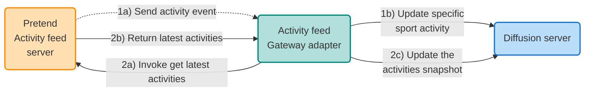

# Activity feed Gateway adapter example

This project demonstrates the use of the Diffusion Gateway Framework.  The 
Gateway Framework provides an easy and consistent way to develop applications
that need to connect to a 'source' or 'sink' system and get data in and out
of Diffusion.

## How to build the project

    mvn clean install

## How to run the Activity feed Gateway adapter

    java -Dgateway.config.file=activity-feed-adapter/src/main/resources/configuration.json -Dgateway.config.use-local-services=true -jar .\activity-feed-adapter\target\activity-feed-adapter-1.0.0-jar-with-dependencies.jar

MORE INFORMATION TO FOLLOW......

NOTES:

        //TODO: JH - get parameters - for now, won't use a schema - but I do need to mention it.

