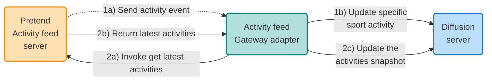

# Activity feed Gateway adapter example

This project demonstrates the use of the Diffusion Gateway Framework.  The 
Gateway Framework provides an easy and consistent way to develop applications
that need to connect to a 'source' or 'sink' system and get data in and out
of Diffusion.

## How to build the project

    mvn clean install

## How to run the Activity feed Gateway adapter

    java -Dgateway.config.file=activity-feed-adapter/src/main/resources/configuration.json -Dgateway.config.use-local-services=true -jar .\activity-feed-adapter\target\activity-feed-adapter-1.0.0-jar-with-dependencies.jar

# Activity Feed Gateway Adapter Example
## Introduction
In this tutorial, you will learn how to use the 'Diffusion Gateway Framework' to develop a Gateway adapter for feeding streaming and batch/polled data into your Diffusion server. The Gateway framework makes it easy to integrate with different datasources for getting data in and out of Diffusion. You will see how the Gateway Framework provides a common and consistent application structure and a higher level of abstraction over the Diffusion SDK, as well as handling things like retries and timeouts.

After completing the tutorial, you can expect to understand how the Gateway framework helps to quickly develop adapters for getting data in and out of Diffusion. You can review and understand the solution code, learn how to run the example, and see the data updated in the Diffusion Console.

## Overview
This example uses the concept of a sporting activity feed (think along the lines of popular exercise/social networks). Naturally, we don't build the platform for this tutorial; instead, we use a pretend activity feed server that generates realistic random sports activity data.

The pretend activity feed server provides a client API that allows an application to subscribe to a feed of activities, with the changes pushed to the subscribed clients as they happen - so, this would be like someone completing an activity, uploading it and then the activity is sent as an event to subscribers. Additionally, the pretend activity feed client API has a mechanism for requesting a snapshot of the latest activities at a point in time.

In this tutorial, we'll integrate the Gateway Framework with the pretend activity feed server and demonstrate data streaming into the Gateway adapter and polling to receive the activity snapshot.

The final solution comprises the following:
- Pretend sports activity feed server - this provides a client API for receiving streaming events and the ability to request a snapshot of the latest activities.
- Gateway adapter - this is the application you will learn to build; it will integrate with the pretend sports activity feed server and put the data into your Diffusion server.
- Diffusion server - this is a running instance of Diffusion; you can run Diffusion in several different ways, such as running locally on your machine or connecting to a remote Diffusion server.

The activity domain object has the following attributes:
- **Sport:** the sporting activity, such as swimming, sailing, tennis and other sports.
- **Country:** the country where the sports activity took place.
- **Winner:** the name of the person who won the sporting activity.
- **Date of activity:** when the sporting activity took place.

The pretend activity feed client has the following features:
- **Register a listener:** an activity feed listener instance is required, with a callback method of 'onMessage' called when a new activity is sent to the subscriber (in our case, the Gateway adapter).
- **Unregister a listener:** a way of unregistering from the activity feed to stop receiving updates.
- **Get latest activities:** returns a snapshot list of the latest sporting activities when called.

Diagram of final solution:

## Prerequisites
To get started with the sports activity feed example, you will need the following:
- Java 11.
- Your preferred Java IDE.
- A running Diffusion server, this can be running locally or remotely; some of the options are:
    - Install Diffusion via the standard Diffusion installer.
    - Use the Diffusion Docker image to run a container.
    - Use Diffusion Cloud, the DiffusionData SaaS offering.
    - Connect to a Diffusion server running remotely.

The activity feed example code is available on GitHub and is part of the overall Gateway examples project:
* [diffusiondata/gateway-examples](https://github.com/diffusiondata/gateway-examples)

Follow the README file within the activity-feed-adapter module to start building the project and running the example.

## Instructions
Developing the activity feed Gateway adapter requires very little code and just some configuration. Here's what we are going to create:
- A class that implements the `GatewayApplication` interface.
- A class that implements the `PollingSourceHandler` interface.
- A class that implements the `StreamingSourceHandler` interface.
- Simple Gateway adapter runner.
- Create a Gateway adapter configuration file that will be used to configure our streaming and polling handlers.

### Gateway application
The class is a standard way of writing Gateway adapters.  An adapter can then have different types of ServiceHandler for handling streaming, polling or sinking data against various data sources.

The ActivityFeedGatewayApplication class, which implements the GatewayApplication interface.  Here we'll need to implement a few methods, such as:
- getApplicationDetails
- stop

Then, based upon the fact we'll be using a streaming and polling handler, these two methods:
- addStreamingSource
- addPollingSource

### Gateway application runner
class with a main method, this is a typical idiom used by Gateway adapter Developers for launching the Gateway application.

### Polling source handler
We will use this to periodically poll and request the activities snapshot from the pretend activity feed server.

### Streaming source handler
For our example, this will handle the activities sent from the pretend activity feed server and put the data into Diffusion topics.
