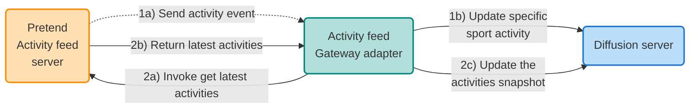

# Activity feed Gateway adapter example

This project demonstrates the use of the Diffusion Gateway Framework.  The 
Gateway Framework provides an easy and consistent way to develop applications
that need to connect to a 'source' or 'sink' system and get data in and out
of Diffusion.

## How to build the project

    mvn clean install

## How to run the Activity feed Gateway adapter

    java -Dgateway.config.file=activity-feed-adapter/src/main/resources/configuration.json -Dgateway.config.use-local-services=true -jar .\activity-feed-adapter\target\activity-feed-adapter-1.0.0-jar-with-dependencies.jar

# Activity Feed Gateway Adapter Example
This article introduces the Diffusion Gateway Framework and an example Gateway Adapter that integrates with a pretend 'Activity' feed server.

## Gateway Framework Overview
The Diffusion 'Gateway Framework' was written to make it easier to create adapters for getting data into Diffusion from source systems or publishing out of Diffusion into target/sink systems.  Whilst it is feasible to develop everything using the standard Diffusion SDKs, the Gateway Framework transparently provides additional features that are frequently required:

- Fault tolerance and failover
- A standard configuration file format with schema IDE support
The ability to control the adapter, either programmatically, via REST API calls or through the Diffusion management console.
- Monitoring facilities, including integration with Prometheus, JMX and the Diffusion management console.

## Activity Feed Example Overview
This example uses the concept of a sporting activity feed (think along the lines of popular exercise/social networks).  Naturally, we don't build the platform for this tutorial; instead, we use a pretend activity feed server that generates realistic random sports activity data.

The pretend activity feed server provides a client API that allows an application to subscribe to a feed of activities, with the changes pushed to the subscribed clients as they happen - so, this would be like someone completing an activity, uploading it and then the activity is sent as an event to subscribers.  Additionally, the pretend activity feed client API has a mechanism for requesting a snapshot of the latest activities at a point in time.

In this tutorial, we'll integrate the Gateway Framework with the pretend activity feed server and demonstrate data streaming into the Gateway adapter and polling to receive the activity snapshot.

The activity domain object has the following attributes:
Sport: the sporting activity, such as swimming, sailing, tennis and other sports.
Country: the country where the sports activity took place.
Winner: the name of the person who won the sporting activity.
Date of activity: when the sporting activity took place.

The pretend activity feed client has the following features:
Register a listener: an activity feed listener instance is required, with a callback method of 'onMessage' called when a new activity is sent to the subscriber (in our case, the Gateway adapter).
Unregister a listener: a way of unregistering from the activity feed to stop receiving updates.
Get latest activities: returns a snapshot list of the latest sporting activities when called.

Below is a diagram depicting the overall example and the key components.

Figure 1.

## Example Code and Configuration Walkthrough
The code for this example is within a Maven module of the Gateway Examples GitHub project:
https://github.com/diffusiondata/gateway-examples

Follow the README file within the activity-feed-adapter module to start building the project and running the example.

Developing the activity feed Gateway adapter requires very little code and just some configuration.  Here's what we are going to create:
A class that implements the 'GatewayApplication' interface is the standard way of writing Gateway adapters.
A 'StreamingSourceHandler' will handle the activities sent from the pretend activity feed server and put the data into Diffusion topics.
A 'PollingSourceHandler' will periodically poll and request the activities snapshot from the pretend activity feed server.
