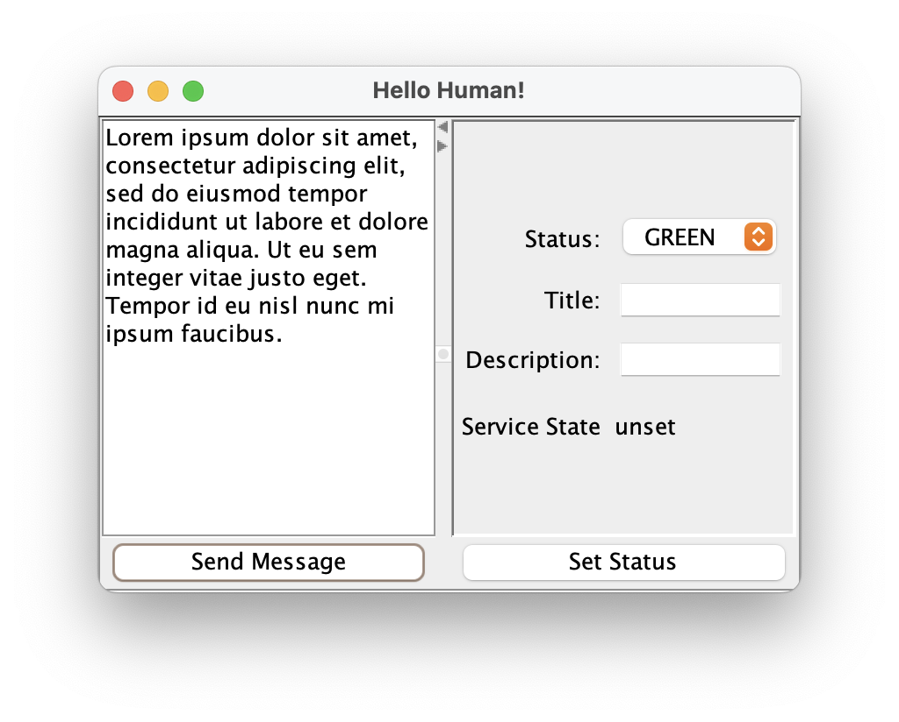

# Human Adapter

The Human Adapter is a Gateway Framework example that treats the user as the external system. Once configured and running The Human Adapter creates a GUI window for interaction. Users can publish a value, and they can set and get the current service state. The example illustrates how to publish values and correctly react to service state changes.

## Configuration

Configuration is deliberately simple. A service takes two parameters.

1. `greeting`'` - a string greeting to display in the GUI so the user can differentiate multiple services
2. `topic` -  A Diffusion topic path to which values should be published./ 