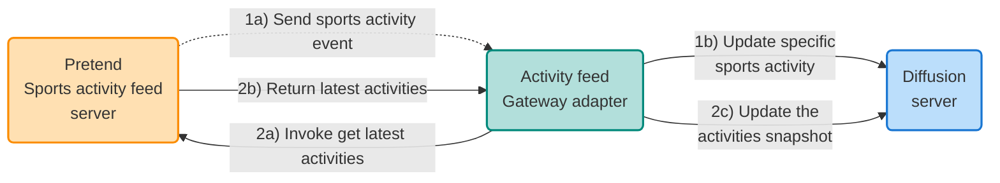

# Activity feed Gateway adapter example

This project demonstrates the use of the Diffusion Gateway Framework.  The 
Gateway Framework provides an easy and consistent way to develop applications
that need to connect to a 'source' or 'sink' system and get data in and out
of Diffusion.

## How to build the project

    mvn clean install


## How to run the Activity feed Gateway adapter

    java -Dgateway.config.file=sports-activity-feed-adapter/src/main/resources/configuration.json -Dgateway.config.use-local-services=true -jar .\sports-activity-feed-adapter\target\sports-activity-feed-adapter-1.0.0-jar-with-dependencies.jar


---
# Sports activity feed Gateway adapter example

## Introduction
In this tutorial, you will learn how to use the 'Diffusion Gateway Framework' to develop a Gateway adapter for feeding streaming and batch/polled data into your Diffusion server. The Gateway framework makes it easy to integrate with different datasources for getting data in and out of Diffusion. You will see how the Gateway Framework provides a common and consistent application structure and a higher level of abstraction over the Diffusion SDK, as well as handling things like retries and timeouts.

After completing the tutorial, you can expect to understand how the Gateway framework helps to quickly develop adapters for getting data in and out of Diffusion. You can review and understand the solution code, learn how to run the example, and see the data updated in the Diffusion Console.

## Overview
This example uses the concept of a sporting activity feed (think along the lines of popular exercise/social networks). Naturally, we don't build the platform for this tutorial; instead, we use a pretend sports activity feed server that generates realistic random sports activity data.

The pretend sports activity feed server provides a client API that allows an application to subscribe to a feed of activities, with the changes pushed to the subscribed clients as they happen - so, this would be like someone completing a sports activity, uploading it and then the sports activity is sent as an event to subscribers. Additionally, the pretend sports activity feed client API has a mechanism for requesting a snapshot of the latest activities at a point in time.

In this tutorial, we'll integrate the Gateway Framework with the pretend sports activity feed server, demonstrate data streaming into the Gateway adapter and poll the data to receive the sports activity snapshot.

The final solution comprises the following:
- Pretend sports activity feed server - this provides a client API for receiving streaming events and the ability to request a snapshot of the latest activities.
- Gateway adapter - this is the application you will learn to build; it will integrate with the pretend sports activity feed server and put the data into your Diffusion server.
- Diffusion server - this is a running instance of Diffusion; you can run Diffusion in several different ways, such as running locally on your machine or connecting to a remote Diffusion server.

The sports activity domain object has the following attributes:
- **Sport:** the sporting activity includes swimming, sailing, tennis and other sports.
- **Country:** the country where the sports activity took place.
- **Winner:** the name of the person who won the sporting activity.
- **Date of activity:** when the sporting activity took place.

The pretend sports activity feed client has the following features:
- **Register a listener:** a sports activity feed listener instance is required, with a callback method of 'onMessage' called when a new sports activity is sent to the subscriber (in our case, the Gateway adapter).
- **Unregister a listener:** a way of unregistering from the sports activity feed to stop receiving updates.
- **Get latest activities:** returns a snapshot list of the latest sporting activities when called.

Diagram of final solution:



## Prerequisites
To get started with the sports activity feed example, you will need the following:
- Java 11.
- Your preferred Java IDE.
- A running Diffusion server, this can be running locally or remotely; some of the options are:
  - Install Diffusion via the standard Diffusion installer.
  - Use the Diffusion Docker image to run a container.
  - Use Diffusion Cloud, the DiffusionData SaaS offering.
  - Connect to a Diffusion server that is running remotely.

The Sports activity feed example code is available on GitHub and is part of the overall Gateway examples project:
* [diffusiondata/gateway-examples](https://github.com/diffusiondata/gateway-examples)

Follow the README file within the sports-activity-feed-adapter module to start building the project and running the example.

## Instructions
Developing the sports activity feed Gateway adapter requires very little code and just some configuration. Here's what we are going to create:
- A class that implements the `GatewayApplication` interface.
- A class that implements the `PollingSourceHandler` interface.
- A class that implements the `StreamingSourceHandler` interface.
- Simple Gateway adapter runner.
- Create a Gateway adapter configuration file to configure the streaming and polling handlers.

Note: the example code is available in GitHub, so referring to the completed solution may be helpful.

### Gateway application class
Firstly, create a class called `SportsActivityFeedGatewayApplication` that implements the `GatewayApplication` interface.  The class is a standard way of writing Gateway adapters.  An adapter can have different types of `ServiceHandler` for handling streaming, polling or sinking data against your chosen datasources.  You will need to implement a few methods, such as:
- `getApplicationDetails` - provides details of the adapter, such as which types of `ServiceHandler` are available and can be configured.
- `stop` - called when the Gateway adapter shuts down.

As we go through the tutorial, you will need to override two methods:
- `addPollingSource` - adds a polling source to the adapter.
- `addStreamingSource` - adds a streaming source to the adapter.

Because our Gateway adapter will integrate with the pretend sports activity feed server, we'll pass a `SportsActivityFeedClient` reference in the constructor for later use by the streaming and polling service handlers.  The `ObjectMapper` is used to convert our SportsActivity object into JSON.  Our code will initially look something like:

```java
public final class SportsActivityFeedGatewayApplication  
    implements GatewayApplication {  
  
    static final String APPLICATION_TYPE =  
        "sports-activity-feed-application";  
  
    static final String STREAMING_SPORTS_ACTIVITY_FEED_SERVICE_TYPE_NAME =  
        "streaming-sports-activity-feed-service";  
  
    static final String POLLING_SPORTS_ACTIVITY_FEED_SERVICE_TYPE_NAME =  
        "polling-sports-activity-feed-service";  
  
    private static final Logger LOG =  
        LoggerFactory.getLogger(SportsActivityFeedGatewayApplication.class);  
  
    private final SportsActivityFeedClient sportsActivityFeedClient;  
    private final ObjectMapper objectMapper;  
  
    public SportsActivityFeedGatewayApplication(  
        SportsActivityFeedClient sportsActivityFeedClient,  
        ObjectMapper objectMapper) {  
  
        this.sportsActivityFeedClient =  
            requireNonNull(sportsActivityFeedClient,  
                "sportsActivityFeedClient");  
  
        this.objectMapper =  
            requireNonNull(objectMapper, "objectMapper");  
    }  
  
    @Override  
    public ApplicationDetails getApplicationDetails()  
        throws ApplicationConfigurationException {  
  
        return DiffusionGatewayFramework.newApplicationDetailsBuilder()  
            .build(APPLICATION_TYPE, 1);  
    }  
  
    @Override  
    public CompletableFuture<?> stop() {  
        LOG.info("Application stop");  
  
        return CompletableFuture.completedFuture(null);  
    }  
}```

### Gateway application runner class
Create a new class called `Runner` - a simple Java class with a `main` method; this is a typical idiom Gateway adapters use for launching the Gateway application.

```java
public final class Runner {  
    public static void main(String[] args) {  
        DiffusionGatewayFramework.start(createGatewayApplication());  
    }  
  
	static GatewayApplication createGatewayApplication() {  
        return new SportsActivityFeedGatewayApplication(  
            SportsActivityFeedClientImpl.connectToActivityFeedServer(),  
            createAndConfigureObjectMapper()); // Utility method for mapper date formatting
    }  
}
```

### Polling source handler class and configuration
Create a class called `SportsActivityFeedPollingSourceHandler` and have it implement the `PollingSourceHandler` interface.  We will use this to periodically poll and request the activities snapshot from the pretend sports activity feed server.  The `PollingSourceHandler` interface will require us to implement the following methods:
- `poll` - this method is periodically called by the Gateway framework based on configuration.
- `pause` - called when the Gateway adapter enters the paused state.
- `resume` - is called when the Gateway adapter can resume.

In your `poll` method, we will call the pretend sports activity feed server's `getSportsLatestActivities()` using the `SportsActivityFeedClient` reference passed into the constructor.  Below is the complete code for the polling source handler:

```java
public final class SportsActivityFeedPollingSourceHandler  
    implements PollingSourceHandler {  
  
    static final String DEFAULT_POLLING_TOPIC_PATH =  
        "default/sports/activity/feed/snapshot";  
  
    private static final Logger LOG =  
        LoggerFactory.getLogger(  
            SportsActivityFeedPollingSourceHandler.class);  
  
    private final SportsActivityFeedClient sportsActivityFeedClient;  
    private final Publisher publisher;  
    private final StateHandler stateHandler;  
    private final ObjectMapper objectMapper;  
    private final String topicPath;  
  
    public SportsActivityFeedPollingSourceHandler(  
        SportsActivityFeedClient sportsActivityFeedClient,  
        ServiceDefinition serviceDefinition,  
        Publisher publisher,  
        StateHandler stateHandler,  
        ObjectMapper objectMapper) {  
  
        this.sportsActivityFeedClient =  
            requireNonNull(sportsActivityFeedClient,  
                "sportActivityFeedClient");  
  
        this.publisher = requireNonNull(publisher, "publisher");  
        this.stateHandler = requireNonNull(stateHandler, "stateHandler");  
        requireNonNull(serviceDefinition, "serviceDefinition");  
        this.objectMapper = requireNonNull(objectMapper, "objectMapper");  
  
        topicPath = serviceDefinition.getParameters()  
            .getOrDefault("topicPath", DEFAULT_POLLING_TOPIC_PATH)  
            .toString();  
    }  
  
    @Override  
    public CompletableFuture<?> poll() {  
        final CompletableFuture<?> pollCf = new CompletableFuture<>();  
  
        if (!stateHandler.getState().equals(ServiceState.ACTIVE)) {  
            pollCf.complete(null);  
  
            return pollCf;  
        }  
  
        final Collection<SportsActivity> activities =  
            sportsActivityFeedClient.getLatestSportsActivities();  
  
        if (activities.isEmpty()) {  
            pollCf.complete(null);  
  
            return pollCf;  
        }  
  
        try {  
            final String value = objectMapper.writeValueAsString(activities);  
  
            publisher.publish(topicPath, value)  
                .whenComplete((o, throwable) -> {  
                    if (throwable != null) {  
                        pollCf.completeExceptionally(throwable);  
                    }  
                    else {  
                        pollCf.complete(null);  
                    }  
                });  
        }  
        catch (JsonProcessingException |  
               PayloadConversionException e) {  
  
            LOG.error("Failed to convert sports activity to JSON", e);
            pollCf.completeExceptionally(e);  
        }  
  
        return pollCf;  
    }  
  
    @Override  
    public CompletableFuture<?> pause(PauseReason reason) {  
        LOG.info("Paused sports activity feed polling handler");  
  
        return CompletableFuture.completedFuture(null);  
    }  
  
    @Override  
    public CompletableFuture<?> resume(ResumeReason reason) {  
        LOG.info("Resumed sports activity feed polling handler");  
  
        return CompletableFuture.completedFuture(null);  
    }  
}
```

#### Add polling service to the Gateway application class
Now you have created the polling service class, we can add it to the `getApplicationDetails` as a supported service type and then include the code within the `addPollingSource` method that will instantiate an instance of the polling source handler class:

```java
@Override  
public ApplicationDetails getApplicationDetails()  
    throws ApplicationConfigurationException {  
  
    return DiffusionGatewayFramework.newApplicationDetailsBuilder()  
        .addServiceType(  
            POLLING_SPORTS_ACTIVITY_FEED_SERVICE_TYPE_NAME,  
            ServiceMode.POLLING_SOURCE,  
            "Polled sports activity feed snapshot",  
            null)  
        .build(APPLICATION_TYPE, 1);  
}

@Override  
public PollingSourceHandler addPollingSource(  
    ServiceDefinition serviceDefinition,  
    Publisher publisher,  
    StateHandler stateHandler)  
    throws InvalidConfigurationException {  
  
    final String serviceType =  
        serviceDefinition.getServiceType().getName();  
  
    if (POLLING_SPORTS_ACTIVITY_FEED_SERVICE_TYPE_NAME.equals(serviceType)) {  
        return new SportsActivityFeedPollingSourceHandler(  
            sportsActivityFeedClient,  
            serviceDefinition,  
            publisher,  
            stateHandler,  
            objectMapper);  
    }  
  
    throw new InvalidConfigurationException(  
        "Unknown service type: " + serviceType);  
}
```

#### Create the configuration file with the polling service instance
The code for the polling source handler is now complete, so you need to configure the Gateway adapter to use the new polling service.  Gateway adapters use a standard JSON configuration file; schema definitions exist for validation and IDE support.  Below is the configuration with an instance of the polling handler configured:

```json
{  
  "id": "sports-activity-feed-adapter-1",  
  "framework-version": 1,  
  "application-version": 1,  
  "diffusion": {  
    "url": "ws://localhost:8080",  
    "principal": "admin",  
    "password": "password",  
    "reconnectIntervalMs": 5000  
  },  
  "services": [  
    {  
      "serviceName": "polling-sports-activity-feed-service-1",  
      "serviceType": "polling-sports-activity-feed-service",  
      "config": {  
        "framework": {  
          "pollIntervalMs": 4500,  
          "pollTimeoutMs": 300000,  
          "topicProperties": {  
            "topicType": "JSON",  
            "persistencePolicy": "SESSION",  
            "publishValuesOnly": false,  
            "dontRetainValue": false  
          }  
        },  
        "application": {  
          "topicPath": "sports/activity/feed/snapshot"  
        }  
      }  
    }  
  ]  
}
```

Note: change the Diffusion URL, principal and password to match what is required to connect to your Diffusion server.

Note: the service type "polling-sports-activity-feed-service" is how the configuration is linked to the code in the `getApplicationDetails` method.

#### Run the adapter with the polling service added
After building the project, you can run the sports activity feed Gateway adapter from the root of the Gateway examples project:

```shell
java -Dgateway.config.file=sports-activity-feed-adapter/src/main/resources/configuration.json -Dgateway.config.use-local-services=true -jar .\sports-activity-feed-adapter\target\sports-activity-feed-adapter-1.0.0-jar-with-dependencies.jar
```

Note: the system property `-Dgateway.config.use-local-services=true` tells the adapter to use the configuration that is specified in the configuration file and not to use any configuration cached in the Diffusion server.

Once the Gateway adapter has started, new topics should appear in Diffusion.  Looking in the Diffusion console, it will look something like below:

![[polling-sports-activity-feed-in-diffusion-console.png]]

You should now have a running sports activity feed Gateway adapter polling the pretend sports activity feed server.
